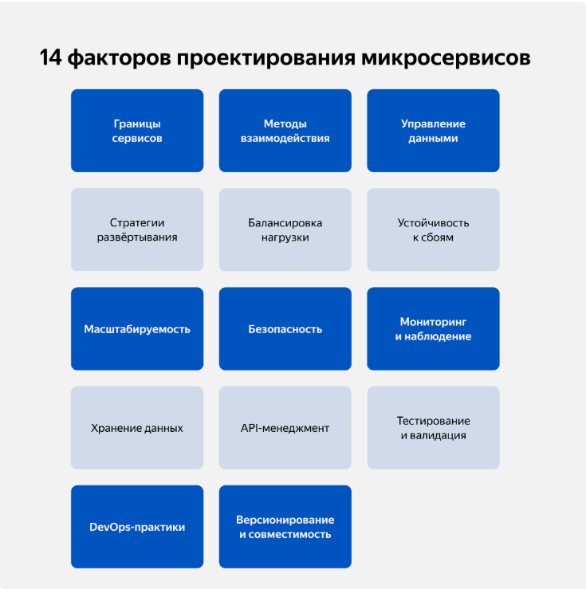

14 основных факторов и те действия, которые помогут добиться эффективной работы микросервисной архитектуры.

[Памятка](https://code.s3.yandex.net/software-architect/14_%D1%84%D0%B0%D0%BA%D1%82%D0%BE%D1%80%D0%BE%D0%B2_%D0%BF%D1%80%D0%BE%D0%B5%D0%BA%D1%82%D0%B8%D1%80%D0%BE%D0%B2%D0%B0%D0%BD%D0%B8%D1%8F_%D0%BC%D0%B8%D0%BA%D1%80%D0%BE%D1%81%D0%B5%D1%80%D0%B2%D0%B8%D1%81%D0%BE%D0%B2.pdf)

